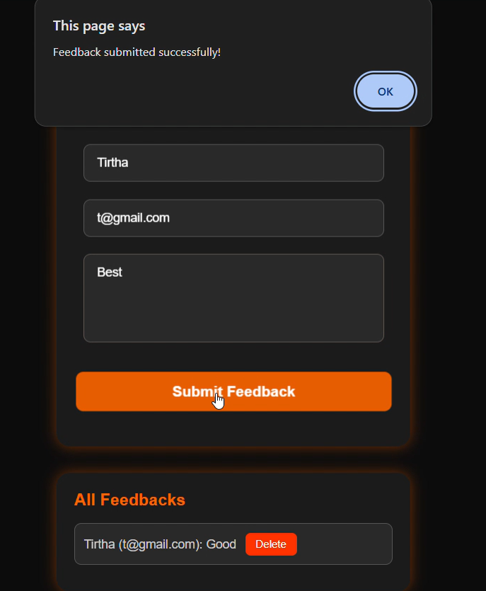
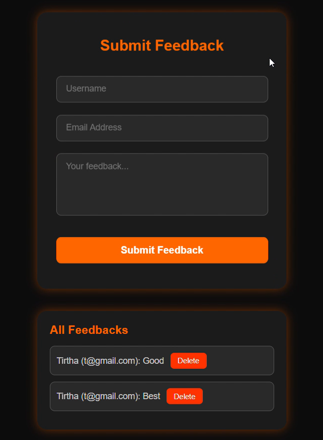
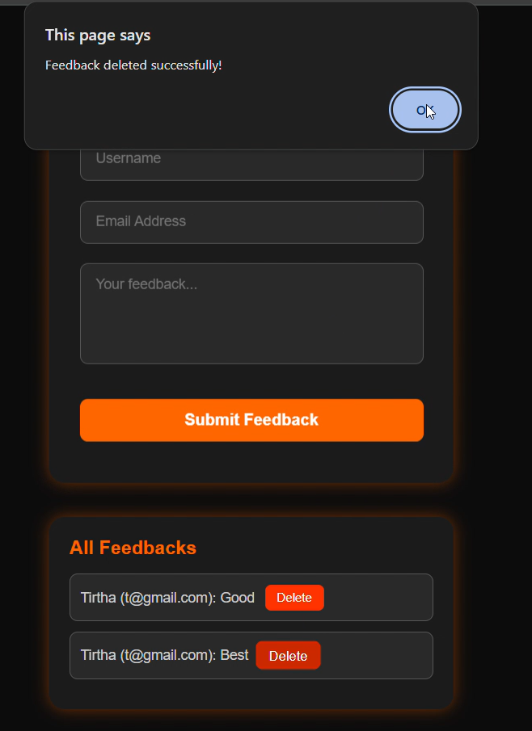

# FeedbackForm

# Overview
This is a basic full-stack project designed for learning Java full-stack development. It is built using Spring Boot for backend and MySQL as the database. The project provides functionalities for creating and deleting feedback entries.

# Features
- Create feedback entries
- Delete feedback entries
- Connected to MySQL database
- Built using Spring Boot and Java Full Stack Development

# Technologies Used
- Java
- Spring Boot
- MySQL
- HTML, CSS, JavaScript (Frontend)

## Screenshots
| Feature | Screenshot |
|---------|------------|
| Login Page |  |
| Submit Feedback Form |  |
| After Submission |  |
| Delete Feedback Page |  |
| After Deletion |  |


# Setup Instructions
- Clone the repository:
  ```bash
      git clone <repository_url>
- Navigate to the project directory:
  ```bash
      cd project-feedback-form
- Set up MySQL database:
  - Create a database named feedback_db
  - Update database credentials in application.properties
- Install dependencies and run the backend:
  ```bash
      mvn spring-boot:run
- Open the frontend in a browser and interact with the feedback form.

# Contribution
- Feel free to contribute by creating pull requests or suggesting improvements.

# License
- This project is open-source and free to use.
